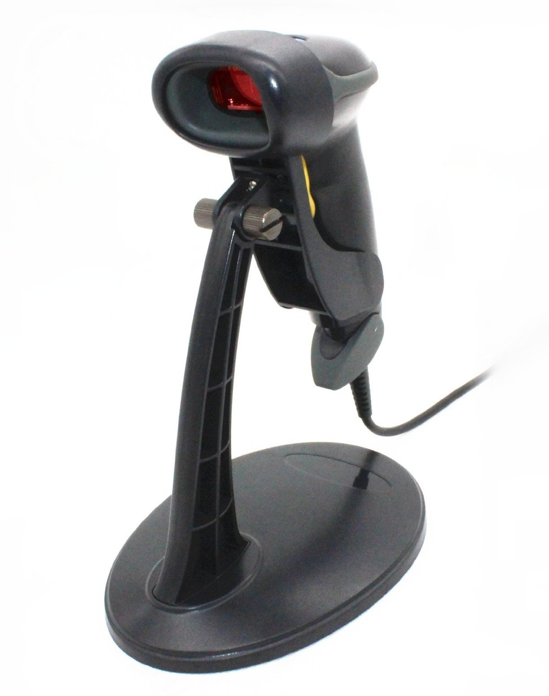

# PlentyOfBooks

### Python program to help with the organization of books purchased from the goodwill clearance center.

### This program grabs the following information after a Barcode is scanned/inputted:

* Book Title
* Amazon Seller Ranking
* Amazon (Book) Ranking
* Author
* Publisher
* Used Price
* New Price
* Review Count
* Trade in Value (If applicable)

### It will generate a CSV file with all of the books scanned during a session.

## How to run


#### Before starting, you'll need to install the python modules from the requirements.txt file.  Open a command window in the PlentyOfBooks folder, and run the following command:

```pip install -r requirements.txt```

#### To start the application, run the following command from the PlentyOfBooks directory:

```python main.py```


## (Optional) Scanner


While this does allow you to input barcodes by hand, it is SIGNIFICANTLY faster to use a barcode scanner.

I recommend this scanner:




[It can be purchased for ~$20 from Amazon](https://www.amazon.com/Automatic-Barcode-Scanning-Bar-code-Adjustable/dp/B00406YZGK/ref=sr_1_1?s=offic-electronics&ie=UTF8&qid=1513031099&sr=1-1&keywords=barcode+scanner).

With relatively fast internet, you should be able to go through ~30 books per minute with that scanner.


